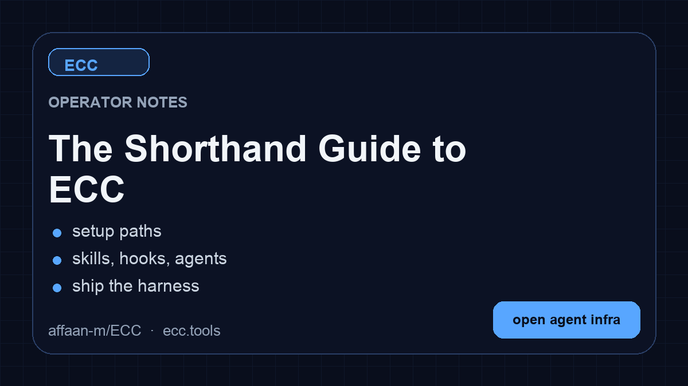
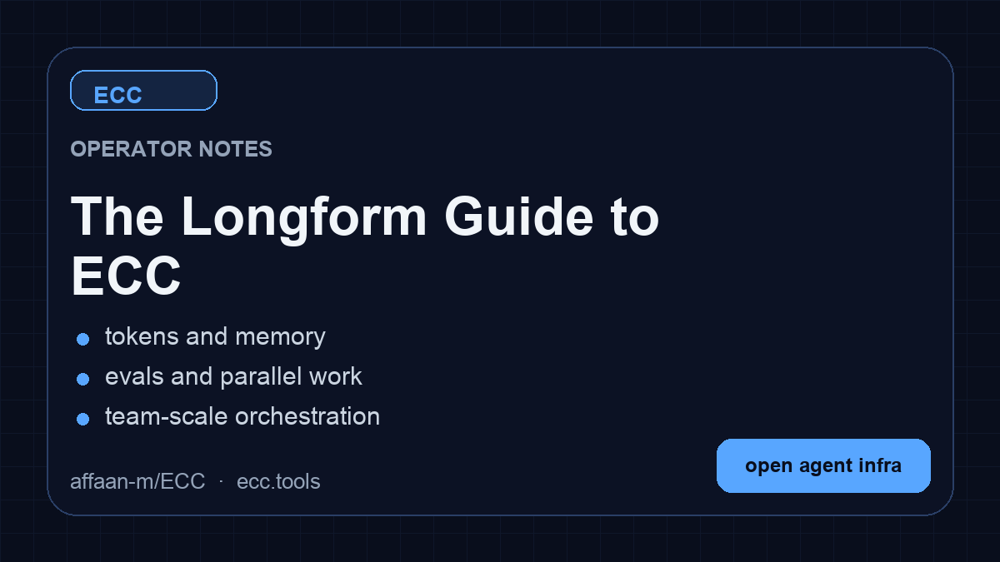

# Rehberler

Bu repository yalnızca ham kodu içerir. Rehberler her şeyi açıklıyor.

<table>
<tr>
<td width="33%">

</td>
<td width="33%">

</td>
<td width="33%">

</td>
</tr>
<tr>
<td align="center"><b>Kısa Rehber</b> Kurulum, temeller, felsefe. <b>İlk önce bunu okuyun.</b></td>
<td align="center"><b>Uzun Rehber</b> Token optimizasyonu, memory kalıcılığı, eval'ler, paralelleştirme.</td>
<td align="center"><b>Güvenlik Rehberi</b> Saldırı vektörleri, sandboxing, sanitizasyon, CVE'ler, AgentShield.</td>
</tr>
</table>

| Konu | Öğrenecekleriniz |
|------|------------------|
| Token Optimizasyonu | Model seçimi, system prompt daraltma, background process'ler |
| Memory Kalıcılığı | Oturumlar arası bağlamı otomatik kaydet/yükle hook'ları |
| Sürekli Öğrenme | Oturumlardan otomatik pattern çıkarma ve yeniden kullanılabilir skill'lere dönüştürme |
| Verification Loop'ları | Checkpoint vs sürekli eval'ler, grader tipleri, pass@k metrikleri |
| Paralelleştirme | Git worktree'ler, cascade metodu, instance'ları ne zaman ölçeklendirmeli |
| Subagent Orkestrasyonu | Context problemi, iterative retrieval pattern |
