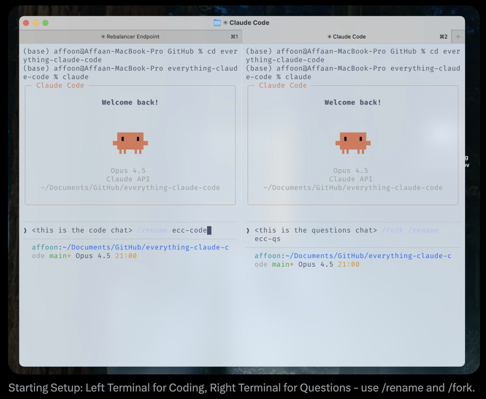
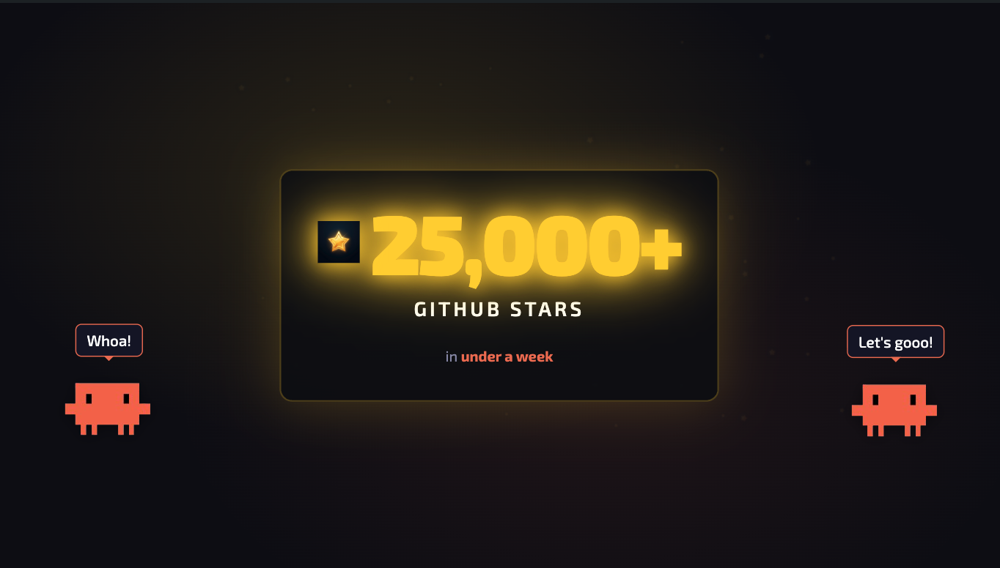

# Claude Code'a Dair Her Şey İçin Uzun Rehber


---

> **Önkoşul**: Bu rehber, [Claude Code'a Dair Her Şey İçin Kısa Rehber](./the-shortform-guide.md) üzerine inşa edilmiştir. Skills, hooks, subagents, MCP'ler ve plugins kurulumunu henüz yapmadıysanız önce onu okuyun.


*Kısa Rehber - önce bunu okuyun*

Kısa rehberde temel kurulumu ele almıştım: skills ve commands, hooks, subagents, MCP'ler, plugins ve etkili bir Claude Code iş akışının omurgasını oluşturan yapılandırma desenleri. O rehber, kurulum ve temel altyapı rehberiydi.

Bu uzun rehber, verimli seansları boşa giden seanslardan ayıran tekniklere giriyor. Kısa rehberi okumadıysanız geri dönüp önce yapılandırmalarınızı kurun. Bundan sonrası, skills, agents, hooks ve MCP'lerin hâlihazırda yapılandırılmış ve çalışır durumda olduğunu varsayar.

Buradaki ana temalar şunlar: token ekonomisi, bellek kalıcılığı, doğrulama desenleri, paralelleştirme stratejileri ve yeniden kullanılabilir iş akışları inşa etmenin bileşik etkileri. Bunlar, 10+ aylık günlük kullanımda rafine ettiğim; ilk saat içinde context rot'a saplanmak ile saatlerce üretken kalmak arasındaki farkı yaratan desenlerdir.

Kısa ve uzun rehberlerde ele alınan her şey GitHub'da mevcut: `github.com/affaan-m/everything-claude-code`

---

## İpuçları ve Püf Noktaları

### Bazı MCP'ler Değiştirilebilir ve Bağlam Pencerenizi Rahatlatır

Sürüm kontrolü (GitHub), veritabanları (Supabase), dağıtım (Vercel, Railway) vb. MCP'ler için: bu platformların çoğunun zaten güçlü CLI'ları var; MCP esasen bu CLI'ları sarmalıyor. MCP güzel bir sarmalayıcıdır ama bir maliyeti vardır.

MCP'yi fiilen kullanmadan, onunla gelen küçülmüş bağlam penceresinden de kaçınarak CLI'ın MCP gibi işlev görmesini istiyorsanız, işlevselliği skills ve commands içine paketlemeyi düşünün. MCP'nin işi kolaylaştırmak için sunduğu araçları ayırın ve bunları komutlara dönüştürün.

Örnek: GitHub MCP'yi sürekli yüklü tutmak yerine, `gh pr create` komutunu tercih ettiğiniz seçeneklerle sarmalayan bir `/gh-pr` komutu oluşturun. Supabase MCP'nin bağlam yemesi yerine, Supabase CLI'ı doğrudan kullanan skills oluşturun.

Lazy loading ile bağlam penceresi sorunu büyük ölçüde çözülüyor. Fakat token kullanımı ve maliyet aynı şekilde çözülmüş olmuyor. CLI + skills yaklaşımı hâlâ bir token optimizasyon yöntemidir.

---

## ÖNEMLİ KISIMLAR

### Bağlam ve Bellek Yönetimi

Seanslar arasında bellek paylaşımı için en iyi yöntem; ilerlemeyi özetleyip kontrol eden, ardından bunu `.claude` klasörünüzde bir `.tmp` dosyasına kaydeden ve seans sonuna kadar bu dosyaya ekleme yapan bir skill ya da command kullanmaktır. Ertesi gün bunu bağlam olarak kullanıp kaldığınız yerden devam edebilir. Eski bağlamı yeni işe bulaştırmamak için her seans adına yeni bir dosya oluşturun.


*Session storage örneği -> <https://github.com/affaan-m/everything-claude-code/tree/main/examples/sessions>*

Claude mevcut durumu özetleyen bir dosya oluşturur. Bunu inceleyin, gerekiyorsa düzenleme isteyin, sonra taze başlayın. Yeni konuşma için yalnızca dosya yolunu verirsiniz. Bağlam sınırlarına yaklaşırken ve karmaşık çalışmaya devam etmeniz gerektiğinde özellikle faydalıdır. Bu dosyalar şunları içermelidir:
- Hangi yaklaşımların işe yaradığı (kanıtlarla doğrulanabilir biçimde)
- Hangi yaklaşımların denendiği ama işe yaramadığı
- Hangi yaklaşımların henüz denenmediği ve geriye ne kaldığı

**Bağlamı Stratejik Olarak Temizleme:**

Planınız hazırlandıktan ve bağlam temizlendikten sonra (Claude Code'da plan mode içinde artık varsayılan seçenek), plan üzerinden çalışabilirsiniz. Yürütme için artık alakalı olmayan çok fazla keşif bağlamı biriktirdiğinizde bu faydalıdır. Stratejik compacting için auto compact'i devre dışı bırakın. Mantıklı aralıklarda manuel compact yapın veya bunu sizin için yapan bir skill oluşturun.

**İleri Seviye: Dinamik System Prompt Injection**

Edindiğim desenlerden biri şu: Her seansta yüklenen CLAUDE.md'ye (kullanıcı kapsamı) veya `.claude/rules/` içine (proje kapsamı) her şeyi koymak yerine, bağlamı dinamik olarak enjekte etmek için CLI flag'lerini kullanın.

```bash
claude --system-prompt "$(cat memory.md)"
```

Bu, hangi bağlamın ne zaman yükleneceği konusunda daha cerrahi davranmanızı sağlar. System prompt içeriğinin otoritesi kullanıcı mesajlarından, kullanıcı mesajlarının otoritesi de tool result'lardan yüksektir.

**Pratik kurulum:**

```bash
# Günlük geliştirme
alias claude-dev='claude --system-prompt "$(cat ~/.claude/contexts/dev.md)"'

# PR inceleme modu
alias claude-review='claude --system-prompt "$(cat ~/.claude/contexts/review.md)"'

# Araştırma/keşif modu
alias claude-research='claude --system-prompt "$(cat ~/.claude/contexts/research.md)"'
```

**İleri Seviye: Bellek Kalıcılığı Hooks**

Belleğe yardımcı olan ve çoğu kişinin bilmediği hook'lar vardır:

- **PreCompact Hook**: Bağlam compact edilmeden önce önemli durumu bir dosyaya kaydeder
- **Stop Hook (Seans Sonu)**: Seans sonunda öğrenimleri bir dosyaya kalıcılaştırır
- **SessionStart Hook**: Yeni seansta önceki bağlamı otomatik yükler

Bu hook'ları ben inşa ettim ve repo içinde şu adresteler: `github.com/affaan-m/everything-claude-code/tree/main/hooks/memory-persistence`

---

### Sürekli Öğrenme / Bellek

Aynı prompt'u birden fazla kez tekrarlamak zorunda kaldıysanız ve Claude aynı probleme takıldıysa ya da daha önce duyduğunuz bir yanıt verdiyse, bu desenlerin skills'e eklenmesi gerekir.

**Problem:** Boşa harcanan token'lar, boşa harcanan bağlam, boşa harcanan zaman.

**Çözüm:** Claude Code önemsiz olmayan bir şey keşfettiğinde — bir hata ayıklama tekniği, bir workaround, projeye özel bir desen — bu bilgiyi yeni bir skill olarak kaydeder. Benzer bir problem bir sonraki kez çıktığında skill otomatik yüklenir.

Bunu yapan bir continuous learning skill'i inşa ettim: `github.com/affaan-m/everything-claude-code/tree/main/skills/continuous-learning`

**Neden UserPromptSubmit Değil de Stop Hook:**

Temel tasarım kararı, UserPromptSubmit yerine **Stop hook** kullanmaktır. UserPromptSubmit her mesajda çalışır ve her prompt'a gecikme ekler. Stop ise seans sonunda bir kez çalışır; hafiftir ve seans sırasında sizi yavaşlatmaz.

---

### Token Optimizasyonu

**Ana Strateji: Subagent Mimarisi**

Kullandığınız araçları ve görev için yeterli olan en ucuz modeli devredecek şekilde tasarlanmış subagent mimarisini optimize edin.

**Model Seçimi Hızlı Referansı:**


*Çeşitli yaygın görevlerde subagent'lerin varsayımsal kurulumu ve seçim gerekçeleri*

| Görev Türü                 | Model  | Neden                                             |
| -------------------------- | ------ | ------------------------------------------------- |
| Keşif/arama                | Haiku  | Hızlı, ucuz, dosya bulmak için yeterince iyi      |
| Basit düzenlemeler         | Haiku  | Tek dosyalı değişiklikler, net talimatlar         |
| Çok dosyalı uygulama       | Sonnet | Kodlama için en iyi denge                         |
| Karmaşık mimari            | Opus   | Derin muhakeme gerekir                            |
| PR incelemeleri            | Sonnet | Bağlamı anlar, nüansı yakalar                     |
| Güvenlik analizi           | Opus   | Zafiyet kaçırma lüksünüz yok                      |
| Dokümantasyon yazımı       | Haiku  | Yapı basittir                                     |
| Karmaşık bug debugging     | Opus   | Tüm sistemi zihinde tutması gerekir               |

Kodlama görevlerinin %90'ında varsayılan olarak Sonnet kullanın. İlk deneme başarısız olduğunda, görev 5+ dosyaya yayıldığında, mimari kararlar söz konusu olduğunda veya güvenlik açısından kritik kodlarda Opus'a yükseltin.

**Fiyatlandırma Referansı:**


*Kaynak: <https://platform.claude.com/docs/en/about-claude/pricing>*

**Araca Özel Optimizasyonlar:**

grep'i mgrep ile değiştirin. Geleneksel grep veya ripgrep'e kıyasla ortalamada yaklaşık %50 token azalması sağlar:


*50 görevlik benchmark'ımızda mgrep + Claude Code, grep tabanlı iş akışlarına kıyasla benzer veya daha iyi değerlendirilen kalitede yaklaşık 2 kat daha az token kullandı. Kaynak: @mixedbread-ai tarafından mgrep*

**Modüler Kod Tabanının Faydaları:**

Ana dosyaların binlerce satır yerine yüzlerce satır seviyesinde olduğu daha modüler bir kod tabanına sahip olmak, hem token optimizasyon maliyetlerinde hem de işi ilk denemede doğru yaptırmada yardımcı olur.

---

### Doğrulama Döngüleri ve Evals

**Benchmarking İş Akışı:**

Aynı şeyi bir skill ile ve skill olmadan istemeyi karşılaştırın, ardından çıktı farkını kontrol edin:

Konuşmayı fork'layın, bir tanesinde skill olmadan yeni bir worktree başlatın, sonunda diff'i açın ve nelerin loglandığına bakın.

**Eval Deseni Türleri:**

- **Checkpoint-Based Evals**: Açık checkpoint'ler belirleyin, tanımlı kriterlere göre doğrulayın, ilerlemeden önce düzeltin
- **Continuous Evals**: Her N dakikada veya büyük değişikliklerden sonra çalıştırın; full test suite + lint

**Temel Metrikler:**

```
pass@k: k denemeden EN AZ BİRİ başarılı olur
        k=1: %70  k=3: %91  k=5: %97

pass^k: k denemenin TAMAMI başarılı olmalıdır
        k=1: %70  k=3: %34  k=5: %17
```

Sadece çalışması gerekiyorsa **pass@k** kullanın. Tutarlılık şartsa **pass^k** kullanın.

---

## PARALELLEŞTİRME

Çoklu Claude terminal kurulumunda konuşmaları fork'larken, fork ve orijinal konuşmadaki eylemlerin kapsamının iyi tanımlandığından emin olun. Kod değişiklikleri söz konusu olduğunda minimum örtüşmeyi hedefleyin.

**Benim Tercih Ettiğim Desen:**

Kod değişiklikleri için ana chat; kod tabanı ve mevcut durum hakkında sorular veya harici servis araştırmaları için fork'lar.

**Keyfi Terminal Sayıları Üzerine:**


*Boris (Anthropic), birden çok Claude instance'ı çalıştırma üzerine*

Boris'in paralelleştirme üzerine ipuçları var. Yerelde 5 Claude instance'ı ve upstream'de 5 instance gibi şeyler önermişti. Ben keyfi terminal sayıları belirlemeyi önermiyorum. Yeni bir terminal ancak gerçek bir ihtiyaçtan doğmalıdır.

Hedefiniz şu olmalı: **minimum uygulanabilir paralelleştirme miktarıyla ne kadar iş çıkarabilirsiniz?**

**Paralel Instance'lar İçin Git Worktrees:**

```bash
# Paralel çalışma için worktree'ler oluştur
git worktree add ../project-feature-a feature-a
git worktree add ../project-feature-b feature-b
git worktree add ../project-refactor refactor-branch

# Her worktree kendi Claude instance'ına sahip olur
cd ../project-feature-a && claude
```

Instance'larınızı ölçeklendirmeye başlayacaksanız VE birden çok Claude instance'ı birbiriyle örtüşen kod üzerinde çalışıyorsa, git worktrees kullanmanız ve her biri için çok iyi tanımlanmış bir plana sahip olmanız zorunludur. Tüm chat'lerinize ad vermek için `/rename <buraya ad>` kullanın.


*Başlangıç kurulumu: solda kodlama için terminal, sağda sorular için terminal — `/rename` ve `/fork` kullanın*

**Cascade Method:**

Birden çok Claude Code instance'ı çalıştırırken "cascade" deseniyle organize edin:

- Yeni görevleri sağdaki yeni sekmelerde açın
- Soldan sağa, en eskiden en yeniye doğru tarayın
- Aynı anda en fazla 3-4 göreve odaklanın

---

## TEMEL HAZIRLIK

**İki Instance ile Başlangıç Deseni:**

Kendi iş akışı yönetimim için boş bir repo'ya 2 açık Claude instance'ı ile başlamayı seviyorum.

**Instance 1: Scaffolding Agent**
- Scaffold ve temel zemini oluşturur
- Proje yapısını kurar
- Config'leri kurar (CLAUDE.md, rules, agents)

**Instance 2: Deep Research Agent**
- Tüm servislerinize bağlanır, web araması yapar
- Ayrıntılı PRD'yi oluşturur
- Mimari mermaid diyagramları oluşturur
- Referansları gerçek dokümantasyon klipleriyle derler

**llms.txt Deseni:**

Varsa, birçok dokümantasyon referansında ilgili doküman sayfasına ulaştıktan sonra sonuna `/llms.txt` ekleyerek bir `llms.txt` bulabilirsiniz. Bu size dokümantasyonun temiz, LLM için optimize edilmiş bir versiyonunu verir.

**Felsefe: Yeniden Kullanılabilir Desenler İnşa Et**

@omarsar0'dan: "Başlarda yeniden kullanılabilir iş akışları/desenleri inşa etmeye zaman ayırdım. İnşa etmesi zahmetliydi, ama modeller ve agent harness'leri geliştikçe bunun vahşi bir bileşik etkisi oldu."

**Yatırım yapılacak şeyler:**

- Subagents
- Skills
- Commands
- Planlama desenleri
- MCP tools
- Context engineering desenleri

---

## Agents ve Sub-Agents İçin En İyi Uygulamalar

**Sub-Agent Bağlam Problemi:**

Sub-agents, her şeyi dökmek yerine özet döndürerek bağlam tasarrufu sağlamak için vardır. Fakat orkestratör, sub-agent'in sahip olmadığı semantik bağlama sahiptir. Sub-agent yalnızca literal sorguyu bilir; isteğin arkasındaki AMACI bilmez.

**İteratif Retrieval Deseni:**

1. Orkestratör her sub-agent çıktısını değerlendirir
2. Kabul etmeden önce takip soruları sorar
3. Sub-agent kaynağa geri döner, yanıtları alır, geri döndürür
4. Yeterli olana kadar döngüyü sürdürür (en fazla 3 döngü)

**Anahtar:** Yalnızca sorguyu değil, objektif bağlamı da aktarın.

**Sıralı Fazlarla Orkestratör:**

```markdown
Faz 1: ARAŞTIRMA (Explore agent kullan) → research-summary.md
Faz 2: PLAN (planner agent kullan) → plan.md
Faz 3: UYGULAMA (tdd-guide agent kullan) → kod değişiklikleri
Faz 4: İNCELEME (code-reviewer agent kullan) → review-comments.md
Faz 5: DOĞRULAMA (gerekirse build-error-resolver kullan) → tamam veya geri döngü
```

**Temel kurallar:**

1. Her agent BİR net girdi alır ve BİR net çıktı üretir
2. Çıktılar bir sonraki fazın girdisi olur
3. Fazları asla atlamayın
4. Agent'ler arasında `/clear` kullanın
5. Ara çıktıları dosyalarda saklayın

---

## EĞLENCELİ ŞEYLER / KRİTİK DEĞİL, SADECE KEYİFLİ İPUÇLARI

### Özel Status Line

`/statusline` kullanarak ayarlayabilirsiniz. Claude önce status line'ınız olmadığını söyler, sonra sizin için kurabileceğini belirtip içinde ne istediğinizi sorar.

Ayrıca bkz: ccstatusline (özel Claude Code status line'ları için topluluk projesi)

### Sesle Yazdırma

Claude Code ile sesinizle konuşun. Birçok kişi için yazmaktan daha hızlıdır.

- Mac'te superwhisper, MacWhisper
- Transkripsiyon hataları olsa bile Claude niyeti anlar

### Terminal Alias'ları

```bash
alias c='claude'
alias gb='github'
alias co='code'
alias q='cd ~/Desktop/projects'
```

---

## Kilometre Taşı


*Bir haftadan kısa sürede 25.000+ GitHub yıldızı*

---

## Kaynaklar

**Agent Orchestration:**

- claude-flow — Topluluk tarafından inşa edilmiş, 54+ özelleşmiş agent içeren kurumsal orkestrasyon platformu

**Self-Improving Memory:**

- Bu repo içindeki `skills/continuous-learning/` bölümüne bakın
- rlancemartin.github.io/2025/12/01/claude_diary/ - Session reflection deseni

**System Prompts Reference:**

- system-prompts-and-models-of-ai-tools — AI sistem prompt'larının topluluk koleksiyonu (110k+ yıldız)

**Resmî:**

- Anthropic Academy: anthropic.skilljar.com

---

## Referanslar

- [Anthropic: Demystifying evals for AI agents](https://www.anthropic.com/engineering/demystifying-evals-for-ai-agents)
- [YK: 32 Claude Code Tips](https://agenticcoding.substack.com/p/32-claude-code-tips-from-basics-to)
- [RLanceMartin: Session Reflection Pattern](https://rlancemartin.github.io/2025/12/01/claude_diary/)
- @PerceptualPeak: Sub-Agent Context Negotiation
- @menhguin: Agent Abstractions Tierlist
- @omarsar0: Compound Effects Philosophy

---

*Her iki rehberde ele alınan her şey GitHub'da [everything-claude-code](https://github.com/affaan-m/everything-claude-code) adresinde mevcuttur.*
